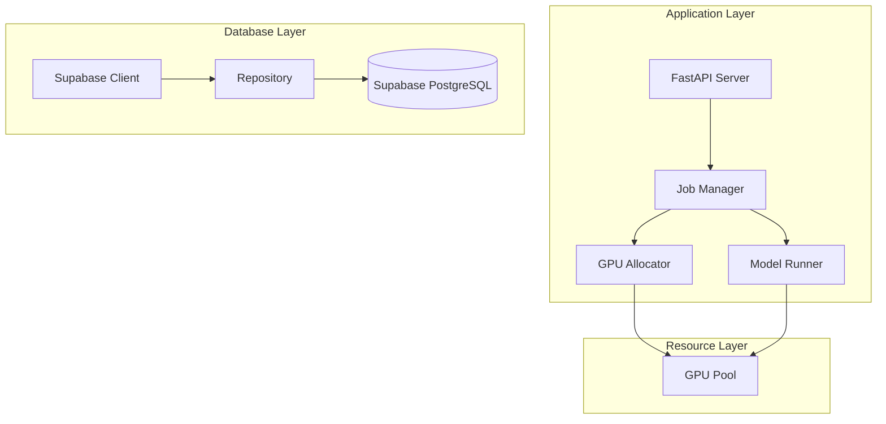

# GPU Fleet Manager - System Architecture

## System Overview

The GPU Fleet Manager is built with a layered architecture focusing on reliability, scalability, and maintainability. Here's a detailed breakdown of each component:



## 1. Database Layer

### Database Schema

The GPU Fleet Manager uses a PostgreSQL database with a comprehensive schema designed for multi-tenant isolation, performance, and scalability. The schema is organized into two main components:

#### Core Multi-Tenant Components

These tables handle user authentication, organization management, and API integrations:

1. **Users & Organizations**: 
   - `users`: User profiles and authentication
   - `organizations`: Tenant accounts
   - `organization_members`: User membership in organizations
   - `organization_invites`: Invitations to join organizations

2. **API Integration**:
   - `api_keys`: API authentication for programmatic access
   - `webhooks`: Notification endpoints for events
   - `webhook_deliveries`: Delivery history for webhooks

#### GPU Management Components

These tables manage GPU resources, job processing, and metrics:

1. **GPU Resources**:
   - `gpu_resources`: Available GPU hardware
   - `gpu_metrics`: Performance metrics for GPUs

2. **Job Processing**:
   - `jobs`: Computational tasks executed on GPUs
   - `cost_tracking`: Financial data for GPU usage

3. **Predictions**:
   - `predictions`: AI/ML prediction tasks and results

The schema implements these key features:

- **Multi-tenant isolation**: Row-Level Security (RLS) policies ensure data separation
- **UUID primary keys**: For security and scalability
- **Consistent timestamps**: All tables include `created_at` and `updated_at` fields
- **Foreign key constraints**: Explicit relationships between tables
- **Performance indices**: Optimized for common query patterns

For detailed documentation, see `docs/database_schema.md`.

### Supabase Client (`src/db/supabase_client.py`)

The foundation of our data access layer, implementing:

1. **Connection Management**:
```python
class SupabaseClient:
    def __init__(self, config: SupabaseConfig):
        self.client = httpx.AsyncClient(
            base_url=config.url,
            timeout=config.timeout,
            limits=httpx.Limits(max_connections=config.max_connections)
        )
```

Key features:
- Connection pooling with configurable limits
- Automatic retry logic with exponential backoff
- Thread-safe singleton pattern
- Comprehensive error handling

2. **Request Handling**:
```python
@retry(
    stop=stop_after_attempt(3),
    wait=wait_exponential(multiplier=1, min=4, max=10)
)
async def _request(
    self,
    method: str,
    endpoint: str,
    params: Optional[Dict[str, Any]] = None,
    json: Optional[Dict[str, Any]] = None,
) -> Dict[str, Any]:
    """Execute HTTP request with retry logic"""
```

Features:
- Automatic retries for transient failures
- Proper error propagation
- Request timeout handling
- Response validation

### Repository Layer (`src/db/repository.py`)

Implements the repository pattern for clean data access:

1. **GPU Operations**:
```python
class Repository:
    @requires_db
    async def allocate_gpu(
        self,
        gpu_id: str,
        job_id: str,
        org_id: str
    ) -> Dict[str, Any]:
        """Atomic GPU allocation with optimistic locking"""
        # First verify GPU is available
        gpu = await self.client.select(
            "gpus",
            filters={
                "id": f"eq.{gpu_id}",
                "status": "eq.available"
            }
        )
```

Features:
- Atomic operations
- Optimistic locking
- Organization-level isolation
- Type-safe interfaces

2. **Job Management**:
```python
@requires_db
async def create_gpu_job(
    self,
    org_id: str,
    job_data: Dict[str, Any]
) -> Dict[str, Any]:
    """Create new GPU job with organization isolation"""
    job_data.update({
        "organization_id": org_id,
        "status": "pending",
        "created_at": datetime.utcnow().isoformat(),
    })
```

Features:
- Multi-tenant isolation
- Automatic timestamps
- Status management
- Data validation

## 2. Resource Management

### GPU Allocator

Handles GPU resource management:

1. **Resource Matching**:
```python
async def get_available_gpus(
    self,
    org_id: str,
    min_memory: Optional[int] = None,
    gpu_type: Optional[str] = None
) -> List[Dict[str, Any]]:
    """Find GPUs matching requirements"""
    filters = {
        "organization_id": f"eq.{org_id}",
        "status": "eq.available"
    }
```

Features:
- Memory requirement matching
- GPU type filtering
- Organization isolation
- Availability checking

2. **Allocation Strategy**:
```python
async def allocate_gpu(
    self,
    gpu_id: str,
    job_id: str,
    org_id: str
) -> Dict[str, Any]:
    """Atomic GPU allocation with conflict prevention"""
```

Features:
- Atomic allocation
- Conflict prevention
- Resource tracking
- Error handling

## 3. Job Lifecycle Management

### Job Manager

Manages the complete job lifecycle:

1. **Job Creation**:
```python
async def submit_test_jobs(self, org_id: str) -> List[Dict]:
    """Submit jobs with different configurations"""
    jobs = []
    test_configs = [
        {
            "name": "Text Generation",
            "model_type": "text",
            "gpu_requirements": {
                "min_memory": 8,
                "gpu_type": "NVIDIA A100"
            }
        }
    ]
```

Features:
- Job configuration validation
- Resource requirement specification
- Organization isolation
- Error handling

2. **Status Management**:
```python
async def monitor_jobs(
    self,
    org_id: str,
    jobs: List[Dict]
) -> None:
    """Real-time job status monitoring"""
    while True:
        current_jobs = await self.db.get_gpu_jobs(org_id)
        # Update status dashboard
```

Features:
- Real-time monitoring
- Status updates
- Resource tracking
- Error detection

## 4. Error Handling

The system implements comprehensive error handling:

1. **Database Errors**:
```python
try:
    await repository.allocate_gpu(gpu_id, job_id, org_id)
except HTTPException as e:
    if e.status_code == 409:  # Conflict
        await handle_allocation_conflict(job_id)
    else:
        await mark_job_failed(job_id)
finally:
    await cleanup_resources()
```

2. **Resource Errors**:
```python
async def handle_allocation_conflict(self, job_id: str):
    """Handle GPU allocation conflicts"""
    await self.update_job_status(job_id, "allocation_failed")
    await self.notify_admin("Allocation conflict detected")
```

## 5. Security

### Multi-tenant Isolation

1. **Organization Filtering**:
```python
def _add_org_filter(self, filters: Dict[str, Any], org_id: str):
    """Add organization isolation to queries"""
    filters["organization_id"] = f"eq.{org_id}"
    return filters
```

2. **Authentication**:
```python
headers = {
    "apikey": config.key,
    "Authorization": f"Bearer {config.key}",
}
```

## 6. Performance Optimization

### Connection Pooling

1. **Pool Configuration**:
```python
limits=httpx.Limits(
    max_connections=config.max_connections,
    max_keepalive_connections=config.max_connections // 2
)
```

### Query Optimization

1. **Efficient Queries**:
```python
@requires_db
async def get_gpu_jobs(
    self,
    org_id: str,
    status: Optional[str] = None,
    limit: int = 100
) -> List[Dict[str, Any]]:
    """Optimized job query with specific columns"""
    filters = {"organization_id": f"eq.{org_id}"}
    if status:
        filters["status"] = f"eq.{status}"
```

## 7. Monitoring and Observability

### Status Dashboard

1. **Real-time Updates**:
```python
table = Table(title="Job Status Dashboard")
table.add_column("Job ID", style="cyan")
table.add_column("Name", style="magenta")
table.add_column("Status", style="green")
```

### Resource Tracking

1. **GPU Utilization**:
```python
async def track_gpu_usage(self):
    """Track GPU utilization metrics"""
    allocated_gpus = await self.get_allocated_gpus()
    for gpu in allocated_gpus:
        # Update utilization metrics
```

## Best Practices

1. **Resource Management**:
   - Use context managers
   - Implement proper cleanup
   - Monitor resource usage

2. **Error Handling**:
   - Use specific exceptions
   - Implement retries
   - Log errors properly

3. **Security**:
   - Validate all inputs
   - Use proper authentication
   - Implement rate limiting

4. **Performance**:
   - Use connection pooling
   - Implement caching
   - Optimize queries

## System Requirements

1. **Hardware**:
   - NVIDIA GPUs (A100 recommended)
   - Sufficient system memory
   - Fast network connection

2. **Software**:
   - Python 3.8+
   - PostgreSQL 13+
   - NVIDIA drivers
   - CUDA toolkit

## Deployment Considerations

1. **Environment Setup**:
   ```bash
   python -m venv venv
   source venv/bin/activate
   pip install -r requirements.txt
   ```

2. **Configuration**:
   ```bash
   # .env file
   SUPABASE_URL=your_url
   SUPABASE_KEY=your_key
   ```

3. **Database Setup**:
   - Create required tables
   - Set up indexes
   - Configure backups
