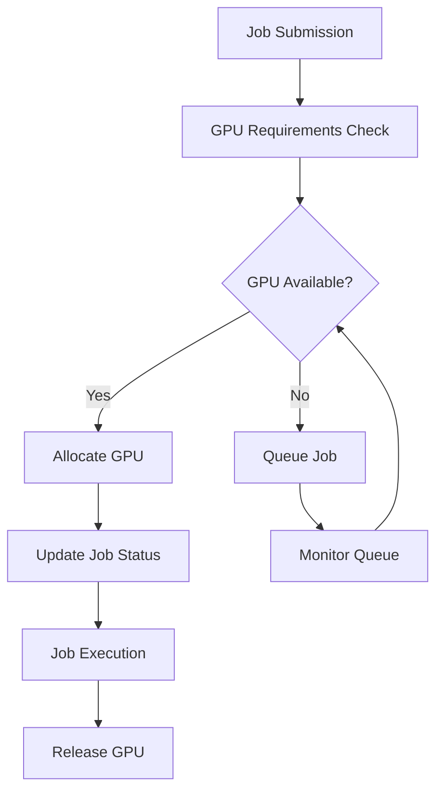

# GPU Fleet Manager

A high-performance GPU resource management system with intelligent job scheduling and multi-tenant support.

## Table of Contents
- [System Architecture](#system-architecture)
- [Core Components](#core-components)
- [Database Layer](#database-layer)
- [Job Lifecycle](#job-lifecycle)
- [Getting Started](#getting-started)
- [Demo System](#demo-system)

## System Architecture

The system is built with a focus on reliability, scalability, and security:



## Core Components

### 1. Database Client (`src/db/supabase_client.py`)
High-performance Supabase client with advanced features:
```python
class SupabaseClient:
    """Singleton client with connection pooling and retry logic"""
    def __init__(self, config: SupabaseConfig):
        self.client = httpx.AsyncClient(
            base_url=config.url,
            timeout=config.timeout,
            limits=httpx.Limits(max_connections=config.max_connections)
        )
```
- Connection pooling
- Automatic retries with exponential backoff
- Thread-safe singleton pattern
- Comprehensive error handling

### 2. Repository Layer (`src/db/repository.py`)
Clean abstraction over database operations:
```python
class Repository:
    """Repository pattern for database operations"""
    @requires_db
    async def allocate_gpu(self, gpu_id: str, job_id: str, org_id: str):
        """Atomic GPU allocation with optimistic locking"""
        return await self.client.update(
            "gpus",
            {"status": "allocated", "job_id": job_id},
            filters={"id": f"eq.{gpu_id}", "status": "eq.available"}
        )
```
- Atomic operations
- Organization-level isolation
- Optimistic locking
- Type-safe interfaces

### 3. Job Lifecycle Management (`src/demo/job_lifecycle.py`)
Complete job management system:
```python
class JobLifecycleDemo:
    """Demonstrates complete job lifecycle"""
    async def submit_test_jobs(self, org_id: str):
        """Submit jobs with different GPU requirements"""
        
    async def allocate_gpus(self, org_id: str, jobs: List[Dict]):
        """Match and allocate GPUs to jobs"""
        
    async def monitor_jobs(self, org_id: str, jobs: List[Dict]):
        """Real-time job status monitoring"""
```

## Database Layer

### Key Features
1. **Connection Management**:
   - Pooled connections (default: 10)
   - Automatic connection recovery
   - Connection timeouts

2. **Data Operations**:
   - Atomic transactions
   - Optimistic locking
   - Bulk operations support

3. **Security**:
   - Multi-tenant isolation
   - API key authentication
   - SQL injection prevention

## Job Lifecycle

### 1. Job Submission
```python
job_data = {
    "name": "Text Generation",
    "model_type": "text",
    "gpu_requirements": {
        "min_memory": 8,
        "gpu_type": "NVIDIA A100"
    }
}
job = await repository.create_gpu_job(org_id, job_data)
```

### 2. GPU Allocation
```python
# Find matching GPU
gpus = await repository.get_available_gpus(
    org_id,
    min_memory=job["gpu_requirements"]["min_memory"],
    gpu_type=job["gpu_requirements"]["gpu_type"]
)

# Atomic allocation
allocated_gpu = await repository.allocate_gpu(
    gpu["id"], 
    job["id"], 
    org_id
)
```

### 3. Job Monitoring
```python
# Real-time status updates
current_jobs = await repository.get_gpu_jobs(org_id)
for job in current_jobs:
    print(f"Job {job['id']}: {job['status']}")
```

## Getting Started

1. **Environment Setup**:
   ```bash
   python -m venv venv
   source venv/bin/activate
   pip install -r requirements.txt
   ```

2. **Configuration**:
   Create `.env` file:
   ```
   SUPABASE_URL=your_url
   SUPABASE_KEY=your_key
   ```

3. **Database Setup**:
   - Create required tables in Supabase
   - Set up organization and GPU records

## Demo System

Run the complete demo:
```bash
./start_demo.sh
```

The demo will:
1. Start the FastAPI server
2. Submit test jobs
3. Allocate GPUs
4. Monitor job status
5. Clean up resources

### Demo Features
- Real-time job status dashboard
- GPU allocation visualization
- Error handling demonstration
- Resource cleanup

### Monitoring Output
```
┌──────────┬──────────────┬──────────┬──────────┬────────────┐
│ Job ID   │ Name         │ Status   │ GPU      │ Updated At │
├──────────┼──────────────┼──────────┼──────────┼────────────┤
│ job-123  │ Text Gen     │ running  │ gpu-456  │ 2025-02-19 │
│ job-124  │ Image Gen    │ waiting  │ N/A      │ 2025-02-19 │
└──────────┴──────────────┴──────────┴──────────┴────────────┘
```

## Error Handling

The system implements comprehensive error handling:
```python
try:
    await repository.allocate_gpu(gpu_id, job_id, org_id)
except HTTPException as e:
    if e.status_code == 409:  # Conflict
        await handle_allocation_conflict(job_id)
    else:
        await mark_job_failed(job_id)
finally:
    await cleanup_resources()
```

## Best Practices

1. **Resource Management**:
   - Always use context managers
   - Implement proper cleanup
   - Monitor resource usage

2. **Error Handling**:
   - Use specific exceptions
   - Implement retries
   - Log errors properly

3. **Security**:
   - Validate all inputs
   - Use proper authentication
   - Implement rate limiting

4. **Performance**:
   - Use connection pooling
   - Implement caching
   - Optimize queries
